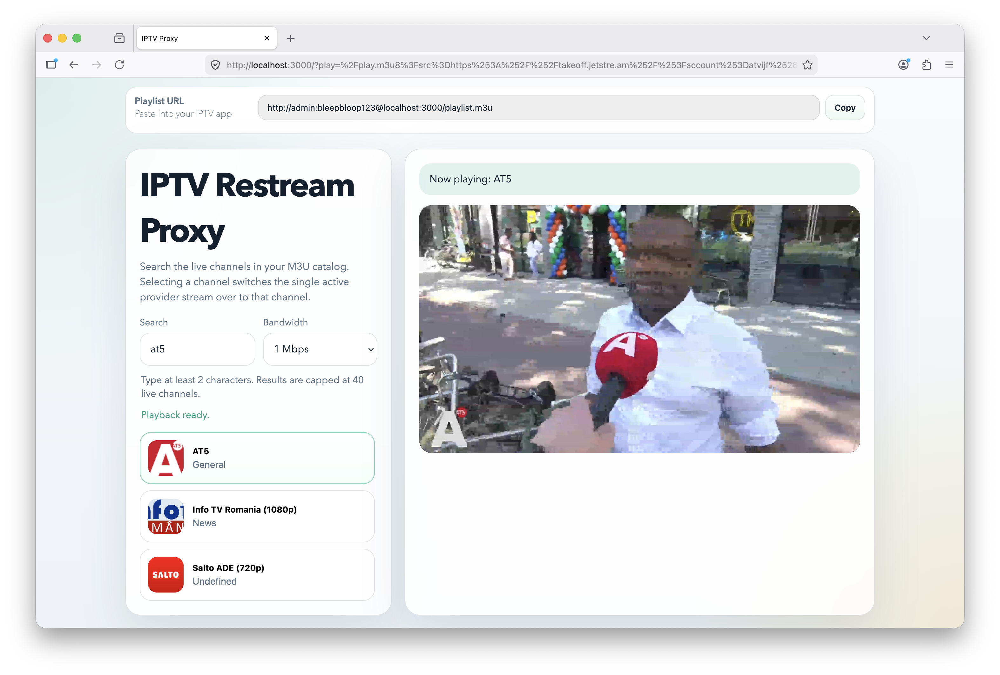
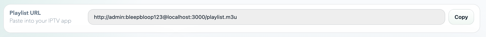
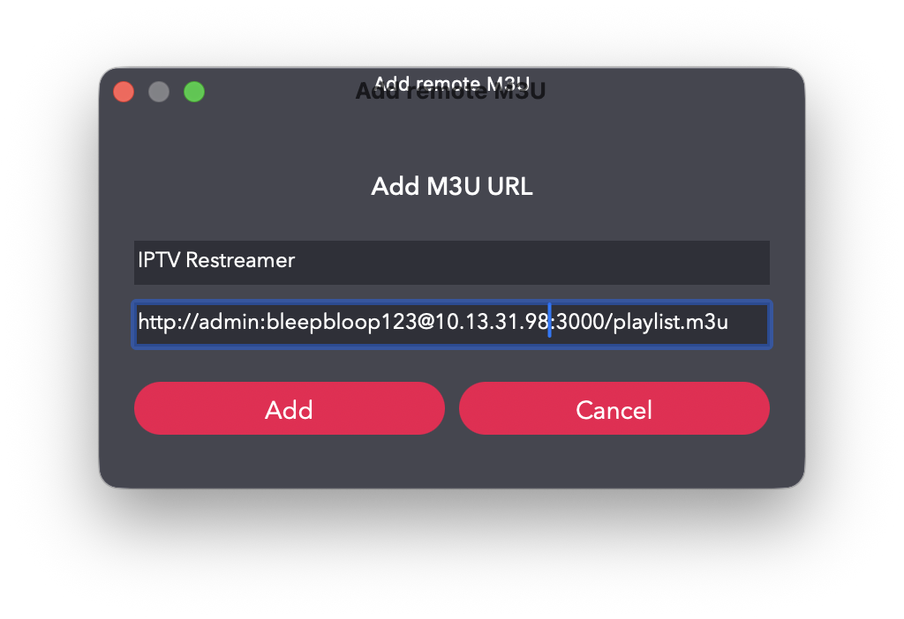
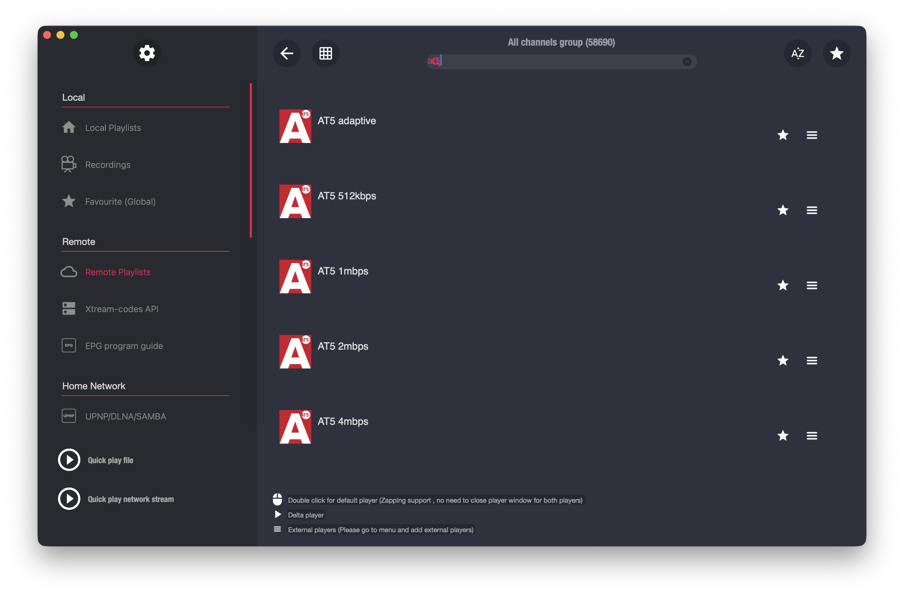

# IPTV restreaming / transcoding proxy

Ever tried watching IPTV on a very slow network connection (e.g. on a plane); or on a public network that tries to block your provider? This repo is here to help. It exposes a very simple proxy server that takes in an IPTV m3u playlist, and on-demand restreams and transcodes (to a lower bitrate) your streams. You install this repo on a server, point your IPTV player app to that server, and done. You can now view your IPTV from anywhere, and optionally lower bandwidth where necessary.

Tested on macOS, but should work on Linux as well.

## Setup

On the host where you'll run this repo, e.g. an always-on server in your house; or a VPS (if they allow this sort of thing).

1. Install [Node.js](https://nodejs.org/en/download) 24 or higher.
2. Install [ffmpeg](https://ffmpeg.org). Make sure `ffmpeg` is in your PATH.
3. Clone this repository:

    ```
    git clone https://github.com/janjongboom/iptv-restream-proxy
    ```

4. Place your `.m3u` file in the root of the `iptv-restream-proxy` folder.
    * If you don't have one, download [https://iptv-org.github.io/iptv/index.m3u](https://iptv-org.github.io/iptv/index.m3u) for some publicly accessible channels.
5. Open a terminal or command prompt, navigate to the `iptv-restream-proxy` folder and run:

    ```bash
    # Install dependencies
    npm ci

    # Start the server
    npm start -- --port=3100 --username=XXX --password=YYY
    ```

    > If you're not exposing the system to the internet you can omit `--username` and `--password`.

## Viewing streams (browser)

Open a browser and navigate to http://localhost:3100 (if on external machine, replace localhost with your external IP / hostname), and log in with the same credentials as above. You'll see a simple UI to view streams directly in your browser.



## Viewing streams (IPTV app)

1. Copy the URL on top of the browser UI (under 'Playlist URL').

    

2. Replace `localhost` with the external IP (e.g. the one you get from Tailscale) of your machine.
3. Paste the URL into your favourite IPTV app.

    

4. You now have all channels available, incl. bitrate choices:

    

5. Play as usual.

## Setting up a VPN between host / client

If you install [Tailscale](https://tailscale.com) on both devices (e.g. your Mac Mini running this repo and your phone), you can use the Tailscale IP of your Mac Mini to connect; so you don't need any VPS set up.

## Limitations

1 stream active at any time. Other streams will be stopped if new ones start. You can watch that same stream from multiple devices at the same time.

## License and attribution

Unless otherwise specified (e.g. on top of the file), this repo is licensed under the Apache 2.0 license.

Almost all code was written by GPT-5.4 (using Codex). Wanted to try this AI coding thing out. So zero guarantees.
